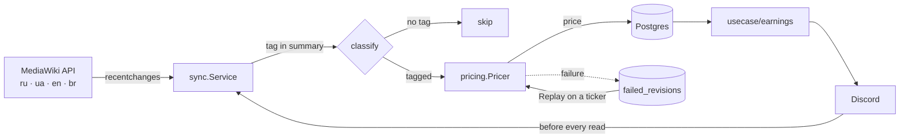

# wiki-earnings

Payroll for the [ProTanki wiki](https://wiki.pro-tanki.online/) editors, with a Discord bot in front of it.

The service reads fresh revisions from the MediaWiki API of every language wiki, works out what kind
of work each one was from a tag in the edit summary, prices it by the article's size and quality,
stores the result in Postgres, and serves reports as Discord slash commands. Pay is denominated in
crystals; every 20 000 crystals also earn the editor a day of premium.

## Contents

- [How it works](#how-it-works)
- [Bot commands](#bot-commands)
- [Pricing](#pricing)
- [Getting started](#getting-started)
- [Configuration](#configuration)
- [Architecture](#architecture)
- [Database schema](#database-schema)
- [Development](#development)

## How it works



Syncing is **not a background job**: it runs before every earnings read, inside the command that
asked for the numbers. Most of the constraints below follow from that — it has to be fast and safe
to call concurrently.

1. **Cursor.** How far each locale has been read lives in `sync_state` as `last_rev_id` plus
   `last_edited_at`. A locale with no cursor starts `INITIAL_LOOKBACK` ago (30 days by default).
2. **Throttling and locking.** A locale synced less than `SYNC_MIN_INTERVAL` ago is left alone.
   Concurrent `Sync` calls collapse into one through `singleflight`, and separate processes are kept
   apart by a Postgres advisory lock (`pg_try_advisory_lock`). Locales run in parallel; one failing
   does not stop the others.
3. **Fetching.** `list=recentchanges` in batches of `SYNC_BATCH_SIZE` (MediaWiki caps this at 500).
   The `rcstart` parameter is inclusive on time, so every batch after the first opens with revisions
   that were already handled — those are dropped by `revid`, which rises monotonically within one wiki.
4. **Processing.** Revisions in a batch are priced in parallel (`SYNC_CONCURRENCY`). A revision with
   no recognised tag, and one made anonymously, are skipped silently. For the rest: resolve the
   editor (registering the wiki account on first sight, picking up renames), fetch the article as it
   was before and after, price the difference, upsert the row.
5. **Budget.** A run is capped at `SYNC_MAX_DURATION`. Hitting the cap is not a failure: the cursor
   is saved after every batch, and the next run carries on from there.
6. **Failures.** A revision that cannot be priced goes to the dead letter (`failed_revisions`) while
   the cursor moves past it regardless — that table becomes the only record it ever existed.
   A separate ticker (`REPLAY_INTERVAL`) tries them again; after `DEAD_LETTER_MAX_ATTEMPTS` failures
   an entry is retired as `permanent` and left alone.

A failed sync is not fatal to a read. The command shows whatever is already stored, marked with
`⚠️ Results may be out of date.`

## Bot commands

Every command acknowledges immediately with a placeholder and edits the real answer in afterwards —
a round trip to the wiki does not fit in Discord's three-second window. Where a cached answer exists
it is shown first, tagged "Refreshing with latest edits…", and replaced once the refresh lands.

| Command | Who | Visibility | What it does |
| --- | --- | --- | --- |
| `/salary <nickname> [month]` | Wiki, Wiki Admin | ephemeral | One editor's total for the month |
| `/edits <nickname> [show_minor] [month]` | Wiki, Wiki Admin | public | Every revision with its price and a link |
| `/report [month]` | Wiki Admin | public | What every editor earned that month |
| `/commands [month]` | Wiki Admin | public | Ready-to-paste `/givecry` and `/addpremium` lines |
| `/changepay <nickname> <edit_id> <new_cost> [locale]` | Wiki Admin | ephemeral | Reprice one revision by hand |
| `/task <text>` | Wiki Admin | ephemeral | Translate a task and post it to every locale's channel |
| `/resync` | Wiki Admin | ephemeral | Wipe sync state and recompute from scratch |

Details:

- **`month`** takes `YYYY-MM` and defaults to the current month. Periods are half-open: `[from, to)`.
- **`show_minor`** on `/edits` controls whether `(ME)` and `(IA)` revisions are listed. By default
  they collapse into a count, but a revision with a hand-set price is always shown.
- **`locale`** on `/changepay` is only needed when the editor has accounts on several wikis: an
  `edit_id` is unique within one wiki, not across them. Left out and ambiguous, the bot asks for it.
  A manual price overrides anything computed, flat rates included, and is journalled in
  `revision_price_overrides` along with who set it.
- **`/task`** takes the text in Russian, translates it once per language in `TASK_TARGETS`, and posts
  each translation to the channels of the locales behind that language. Locales sharing a language
  share one translation and get their own message.
- **`/resync`** clears the cursors and the dead letter for every locale and syncs again from scratch.
  Manual prices survive it. It is slow and hits the wiki hard — for emergencies only.
- **Long answers.** Discord rejects a message over 2000 characters, so answers are cut on line
  boundaries and continued as follow-up messages. A code fence left open by a cut is closed and
  reopened in the next message.
- **Lifetime.** With `MESSAGE_LIFETIME` set, the `/edits` answer is deleted after that long, follow-up
  messages included.
- **Errors** arrive as a separate ephemeral message, and the "thinking…" placeholder is taken down.

## Pricing

### Kind of work

Editors declare what they did by tagging the edit summary on the wiki. An untagged revision is
neither paid nor stored.

| Tag | Kind | Priced as |
| --- | --- | --- |
| `(ME)` | Minor edit | Flat 1 500 |
| `(IA)` | Item addition | Flat 3 500 |
| `(AE)` | Article edit | By how much the article gained |
| `(RA)` | Refactored article | By how much the article gained |
| `(NA)` | New article | The whole article |
| `(TA)` | Translated article | 30 % of the whole article |

When a summary carries several tags the first of `(NA)`, `(TA)`, `(RA)`, `(AE)`, `(IA)`, `(ME)` wins.

### Formulas

Everything that is not a minor edit pays at least `MinPayment` = 3 500. The base unit
`BaseUnitCost` = 100 000 is what a perfect article — every metric maxed out — would be worth.

```
Volume  = min(1, (words + √(table cells) × 16.70) / 2039)
Quality = weighted mean of the quality metrics                    // 0..1

ArticleCost = Volume × (0.191 + 0.809 × Quality) × 100000
EditCost    = (max(0, ΔVolume) × 0.7 + max(0, ΔQuality) × 0.3) × 100000
```

Size sets the scale and quality moves the price within it, so a large but plainly written article
still earns a good part of its worth — that is what the `QualityFloor` = 0.191 term is for. Edits are
paid for gains only: making a metric worse never pushes a price below zero, and never earns anything.

On top of that, adding the `DidYouKnow` template to an article pays a one-off bonus of 1 000.

### Quality metrics

| Metric | Weight | Saturates at | Notes |
| --- | --- | --- | --- |
| Table usage | 3 | 8 cells | Counted from the wikitext |
| Link density | 2 | 8 % of words | Scores 0 below 150 words |
| Section structure | 2 | 10 sections | Scores 0 if the heading hierarchy is broken |
| Image density | 1 | 5 % of words | Scores 0 below 100 words |
| Categories | 1 | 1 category | |
| Template usage | 1 | 10 templates | |

Weights total 10. Every metric returns 0..1 and saturates at its cap — piling on more past that
point earns nothing.

Size (`Volume`) is deliberately not one of these: it scales the price rather than adjusting it.

### Premium

```
days of premium = crystals / 20000   (integer division)
```

Computed from the monthly total, not per revision. `/commands` emits `/addpremium` lines only for
editors who earned at least one full day.

## Getting started

Docker and Docker Compose are all you need.

```bash
cp .env.example .env
# fill in DISCORD_BOT_TOKEN, WIKI_ROLE_ID, WIKI_ADMIN_ROLE_ID

make up-with-migrations
```

After that `make up` is enough. Migrations run under their own compose profile and stay out of a
normal start.

| Target | What it does |
| --- | --- |
| `make up` | Build and start the bot with Postgres |
| `make down` | Stop everything |
| `make up-with-migrations` | Apply migrations, then start |
| `make migrate-up` | Apply migrations |
| `make migrate-down` | Roll back one migration |
| `make migrate-down-all` | Roll back everything |
| `make migrate-create name=foo` | Scaffold a migration pair |
| `make migrate-version` | Current schema version |
| `make test` | Tests with the race detector |
| `make mocks` | Regenerate mocks |

The bot needs the `applications.commands` scope and the Message Content intent. Slash commands are
registered globally at startup and removed on a clean shutdown.

## Configuration

Everything is read from the environment. An unset variable keeps its default; a set but unparsable
one fails the start. Durations use Go syntax: `90s`, `5m`, `720h`.

Under compose all of this comes from `.env`, which is optional — a run with none of it set still
works as long as the three required variables are in the environment. `.env.example` lists the lot.

**Required:**

| Variable | Meaning |
| --- | --- |
| `DISCORD_BOT_TOKEN` | Bot token |
| `WIKI_ROLE_ID` | Role id for wiki editors |
| `WIKI_ADMIN_ROLE_ID` | Role id for wiki admins |

**Postgres:**

| Variable | Default | Notes |
| --- | --- | --- |
| `POSTGRES_USER` | `postgres` | |
| `POSTGRES_PASSWORD` | `postgres` | |
| `POSTGRES_DB` | `wiki` | |
| `POSTGRES_HOST` | `localhost` | Pinned to the compose network under compose |
| `POSTGRES_PORT` | `5432` | Pinned to the compose network under compose |
| `POSTGRES_SSLMODE` | `disable` | Pinned to the compose network under compose |
| `POSTGRES_MAX_CONNS` | `10` | |
| `POSTGRES_MAX_CONN_LIFETIME` | `1h` | |
| `POSTGRES_CONNECT_TIMEOUT` | `5s` | |

**Sync:**

| Variable | Default | Meaning |
| --- | --- | --- |
| `LOCALES` | `ru,ua,en,br` | Language wikis to read, comma separated |
| `TASK_TARGETS` | none | Where `/task` posts: `<locale>:<language>:<channel id>` per locale, comma separated. A locale left out receives no tasks |
| `SYNC_BATCH_SIZE` | `500` | Revisions per request to the wiki (MediaWiki's ceiling) |
| `INITIAL_LOOKBACK` | `720h` | How far back a locale starts with no cursor |
| `SYNC_MIN_INTERVAL` | `1m` | How long a locale is left alone after a sync |
| `SYNC_MAX_DURATION` | `20s` | Budget for one run |
| `SYNC_CONCURRENCY` | `8` | Revisions priced in parallel |
| `DEAD_LETTER_MAX_ATTEMPTS` | `5` | Retries before an entry is retired |
| `DEAD_LETTER_BATCH_SIZE` | `100` | Entries per `Replay` |
| `REPLAY_INTERVAL` | `5m` | How often failed revisions are retried |

**Discord:**

| Variable | Default | Meaning |
| --- | --- | --- |
| `MESSAGE_LIFETIME` | `2m` | How long the `/edits` answer stays up. `0` keeps it forever |

## Architecture

Dependencies point inward: delivery knows about use cases, use cases know about the domain, and the
domain knows about nobody. Every outside dependency is declared as an interface on the consumer's
side, so storage, the wiki client and the pricer are all swappable in tests.

Both entry points need the same graph, so building it lives in `internal/app`. An entry point reads
the configuration, asks `app.New` for the wiring, and hands the parts to whichever delivery it runs.

```
cmd/
  bot/                 Bot entry point: the Discord delivery and the Replay ticker
  console/             Console entry point
internal/
  app/                 The dependency graph both entry points are built on
  config/              Environment loading and validation
  delivery/
    discord/           Slash commands, role gating, formatting, message splitting
    console/           REPL over the same use cases, JSON output
  usecase/
    earnings/          Earnings and reports; syncs before reading
    revisions/         Manual repricing
    resync/            Wipe state and recompute from scratch
  domain/
    entity/            Models, no behaviour
    pricing/           The price formulas
    pricing/metric/    Quality metrics
  sync/                The pipeline: cursors, batches, dead letter, replay
  mediawiki/           Wiki HTTP client with retries, and response parsing
  storage/postgres/    Repositories and the advisory locker
migrations/            SQL migrations (golang-migrate)
```

Decisions worth knowing:

- **A price is computed once, at sync time.** Reading earnings is a `SUM` over rows that were already
  priced; nothing is recomputed to render a report.
- **Writes on the sync path are idempotent.** The cursor is saved per batch, so a crash halfway
  through replays revisions that are already stored.
- **Editors and wiki accounts are separate.** One person has a distinct `userid` on every language
  wiki; all of them fold into one `editor_id`, which is what gets paid. A nickname is only a label,
  so renaming on the wiki breaks nothing.
- **Replay is not part of Sync.** Sync runs on a user request's budget, and working through a backlog
  is not what that budget is for, so a separate ticker drives it.

## Database schema

| Table | Holds |
| --- | --- |
| `editors` | The editor — whoever gets paid |
| `editor_accounts` | Wiki accounts: `(locale, wiki_id)` → `editor_id` |
| `revisions` | Priced revisions: `(locale, revision_id)`, kind, price, manual-price flag |
| `revision_price_overrides` | Journal of manual repricing: old and new price, who and when |
| `failed_revisions` | Dead letter: unpriced revisions, attempt count, last error |
| `sync_state` | Per-locale cursor |

Revision ids are unique only within one wiki, which is why keys are composite throughout —
`(locale, revision_id)`. In the dead letter the author is kept as a raw wiki_id-and-nickname pair
with no foreign key: "the editor is not known yet" is one of the ordinary reasons to end up there.

## Development

```bash
go test ./...            # tests
make test                # the same, with -race
make mocks               # regenerate mocks (mockery)
go run ./cmd/console     # REPL against a real database
```

Mocks are declared in `.mockery.yml` and live next to their interfaces in `mocks` subpackages.
Regenerate them after changing an interface.

Both entry points read plain environment variables, so a local run needs them exported — or a
`docker compose run` that brings its own.

The console is the way to look at the pipeline without Discord in the way. It drives the same use
cases and prints raw JSON.

```
> sync                                  run a sync
> replay                                retry dead-lettered revisions
> resync                                wipe everything and recompute
> salary <nickname> [YYYY-MM]
> edits <nickname> [YYYY-MM]
> report [YYYY-MM]
> changepay <nickname> <edit_id> <new_cost> [locale]
> quit
```
