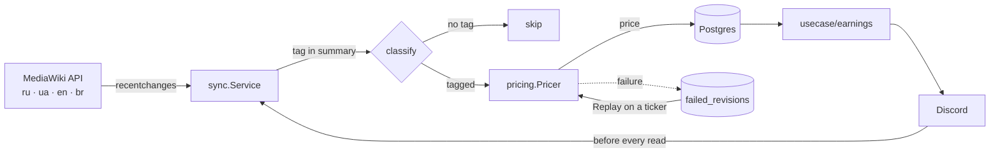

# wiki-earnings

Payroll for the [ProTanki wiki](https://wiki.pro-tanki.online/) editors, with a Discord bot in front of it.

The service reads fresh revisions from the MediaWiki API of every language wiki, works out what kind
of work each one was from a tag in the edit summary, prices it by the article's size and quality,
stores the result in Postgres, and serves reports as Discord slash commands. Pay is denominated in
crystals; every 20 000 crystals also earn the editor a day of premium.

**Go 1.26 · discordgo · pgx · Postgres · golang-migrate · Docker Compose · mockery + testify**

## Bot commands

| Command | Who | What it does |
| --- | --- | --- |
| `/salary <nickname> [month]` | Wiki, Wiki Admin | One editor's total for the month |
| `/edits <nickname> [show_minor] [month]` | Wiki, Wiki Admin | Every revision with its price and a link |
| `/report [month]` | Wiki Admin | What every editor earned that month |
| `/commands [month]` | Wiki Admin | Ready-to-paste `/givecry` and `/addpremium` lines |
| `/paynick <nickname> [payments_nickname]` | Wiki Admin | Set the game account an editor is paid on |
| `/changepay <nickname> <edit_id> <new_cost> [locale]` | Wiki Admin | Reprice one revision by hand |
| `/task <text> [locales] [source_lang]` | Wiki Admin | Translate a task and post it to each locale's channel |
| `/resync` | Wiki Admin | Wipe sync state and recompute from scratch |

Answers longer than Discord's 2000 characters are cut on line boundaries and continued as follow-ups.
A cached answer is shown first and replaced once the refresh lands, so nothing waits on the wiki.

`/task` is translated through free [Cloudflare Workers AI](https://developers.cloudflare.com/workers-ai/) (`@cf/meta/m2m100-1.2b`).
Links, mentions, emoji and code are swapped for placeholders before the text is sent and put back
after, and a translation that lost one is redone around them.

## How it works



Syncing is **not a background job**: it runs before every earnings read, inside the command that
asked for the numbers. Most of the design follows from that.

- **It has to be safe to call concurrently.** Calls within a process collapse through `singleflight`;
  separate processes are kept apart by a Postgres advisory lock. Locales run in parallel, and one
  failing does not stop the others.
- **It has to be fast.** A locale synced in the last minute is skipped, and a run is capped at
  `SYNC_MAX_DURATION`. Hitting the cap is not a failure: the cursor is saved per batch, so the next
  run carries on from there.
- **It has to survive bad data.** A revision that cannot be priced goes to a dead letter and the
  cursor moves past it. A separate ticker retries those, retiring an entry after five attempts.
- **A failed sync is not fatal to a read.** The command shows what is already stored, marked
  `⚠️ Results may be out of date.`

## Pricing

Editors declare what they did by tagging the edit summary. An untagged revision is neither paid nor
stored.

| Tag | Kind | Priced as |
| --- | --- | --- |
| `(ME)` | Minor edit | Flat 1 500 |
| `(IA)` | Item addition | Flat 3 500 |
| `(AE)` / `(RA)` | Article edit, refactor | By how much the article gained |
| `(NA)` | New article | The whole article |
| `(TA)` | Translated article | 30 % of the whole article |

```
Volume  = min(1, (words + √(table cells) × 16.70) / 2039)
Quality = weighted mean of six metrics: tables, links, sections, images, categories, templates

ArticleCost = Volume × (0.191 + 0.809 × Quality) × 100000
EditCost    = (max(0, ΔVolume) × 0.7 + max(0, ΔQuality) × 0.3) × 100000
```

Size sets the scale and quality moves the price within it, so a large but plainly written article
still earns a good part of its worth. Edits are paid for gains only: making an article worse never
earns anything and never pushes a price below zero. Every metric saturates at a cap, so piling on
more past that point is not worth anything either.

## Architecture

Dependencies point inward: delivery knows about use cases, use cases know about the domain, and the
domain knows about nobody. Every outside dependency is an interface declared on the consumer's side,
so storage, the wiki client and the translator are all swappable — and all mocked in tests.

```
cmd/bot, cmd/console    Entry points
internal/
  app/                  The dependency graph both entry points are built on
  config/               Environment loading and validation
  delivery/discord/     Slash commands, role gating, formatting, message splitting
  delivery/console/     REPL over the same use cases, for looking at the pipeline
  usecase/              earnings · editors · revisions · resync · tasks
  domain/               Entities and the price formulas, no I/O
  sync/                 The pipeline: cursors, batches, dead letter, replay
  mediawiki/            Wiki HTTP client and response parsing
  translate/            Translation backends and placeholder protection
  storage/postgres/     Repositories and the advisory locker
migrations/             SQL migrations (golang-migrate)
```

Decisions worth knowing:

- **A price is computed once, at sync time.** Reading earnings is a `SUM` over rows that were already
  priced; nothing is recomputed to render a report.
- **Writes on the sync path are idempotent**, so a crash halfway through a batch costs nothing.
- **Editors and wiki accounts are separate.** One person has a distinct `userid` on every language
  wiki; all of them fold into one editor, which is what gets paid. A nickname is only a label, so
  renaming on the wiki breaks nothing. Revision ids are unique only within one wiki, so keys are
  composite throughout: `(locale, revision_id)`.
- **Replay is not part of Sync.** Sync runs on a user request's budget, and working through a backlog
  is not what that budget is for.

## Getting started

Docker and Docker Compose are all you need.

```bash
cp .env.example .env

make up-with-migrations   # first run
make up                   # after that
```

The bot needs the `applications.commands` scope and the Message Content intent. Slash commands are
registered globally at startup and removed on a clean shutdown.

## Configuration

Everything is read from the environment. An unset variable keeps its default; a set but unparsable
one fails the start. Only three are required — `DISCORD_BOT_TOKEN`, `WIKI_ROLE_ID` and
`WIKI_ADMIN_ROLE_ID`. `.env.example` lists the rest with its defaults: the Postgres connection, the
sync budgets, and `TASK_TARGETS` with the Cloudflare credentials `/task` needs.

## Development

```bash
make test     # tests with the race detector
make mocks    # regenerate mocks (mockery)
make migrate-create name=foo

go run ./cmd/console   # REPL against a real database, JSON output
```
